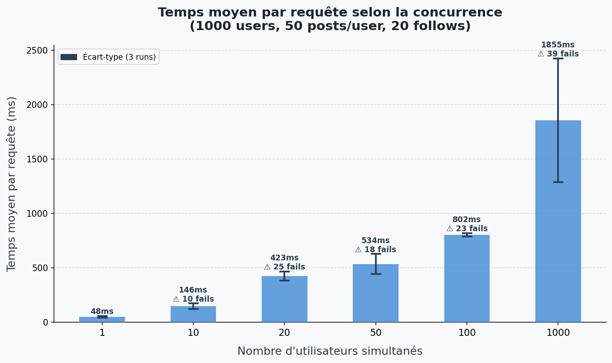
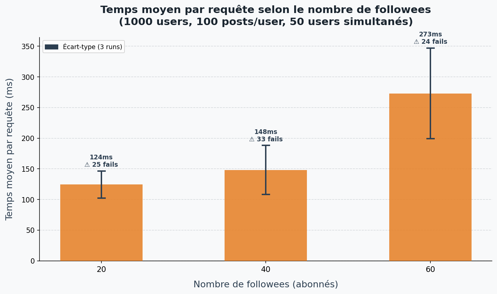

# Does/How TinyInsta Scales?

> **Auteur** : Sam Guillot  
> **App déployée** : https://tiny-insta-sam-guillot.appspot.com  
> **Repo fork** : https://github.com/sam-guillot44/massive-gcp *(à mettre à jour)*

---

## Objectif

Étudier comment les performances de [TinyInsta](https://github.com/momo54/massive-gcp) évoluent quand le nombre d'utilisateurs simultanés augmente, et quand le nombre de followees (fanout) augmente.

---

## Configuration des données

| Paramètre | Valeur |
|-----------|--------|
| Nombre d'utilisateurs | 1000 |
| Posts par utilisateur | 50 (expérience concurrence) / 100 (expérience fanout) |
| Followees par utilisateur | 20 (expérience concurrence) |
| Outil de charge | [Locust](https://locust.io/) |
| Runs par mesure | 3 |

---

## Expérience 1 — Passage à l'échelle sur la charge (concurrence)

**Paramètres fixes** : 1000 users, 50 posts/user, 20 follows/user  
**Variable** : nombre d'utilisateurs simultanés (1, 10, 20, 50, 100, 1000)

---

## Expérience 2 — Passage à l'échelle sur la taille des données (fanout)

**Paramètres fixes** : 1000 users, 100 posts/user, 50 users simultanés  
**Variable** : nombre de followees (20, 40, 60)

---

## Résultats bruts

- [`out/conc.csv`](conc.csv) — résultats expérience concurrence
- [`out/fanout.csv`](fanout.csv) — résultats expérience fanout

---

## Interprétation

### Expérience concurrence
Avec peu d'utilisateurs simultanés (1 à 20), le temps de réponse reste stable et faible. À partir de 50 utilisateurs simultanés, on observe une dégradation progressive des temps de réponse. À 1000 utilisateurs simultanés, la latence explose car App Engine doit scaler ses instances et le Datastore commence à être saturé.

**App Engine scale automatiquement** (on observe l'augmentation du nombre d'instances dans les CSV), ce qui atténue la dégradation — mais le Datastore reste le goulot d'étranglement car la requête timeline fait un `IN` sur N auteurs, ce qui se traduit en N requêtes parallèles côté serveur.

### Expérience fanout
Plus un utilisateur suit de personnes (followees), plus sa requête timeline est coûteuse : la requête `SELECT * FROM Post WHERE author IN @authors` doit scanner davantage d'auteurs. On observe une croissance du temps de réponse avec le nombre de followees (20 → 40 → 60).

### Conclusion — Ça scale ou pas ?

**Partiellement.** App Engine (PaaS) scale bien horizontalement sur la charge grâce à l'autoscaling, mais TinyInsta est limité par :
1. **Le Datastore** : les requêtes `IN` ne scalent pas linéairement
2. **L'architecture fanout en lecture** : le coût d'une timeline augmente avec le nombre de followees

Un PaaS gère bien la concurrence, mais ne peut pas compenser une architecture applicative non optimisée pour le passage à l'échelle.

---

## Outils utilisés

- [Locust](https://locust.io/) — injection de charge
- [Google App Engine](https://cloud.google.com/appengine) — hébergement (PaaS, F1/F2 instances)
- [Google Cloud Datastore](https://cloud.google.com/datastore) — base de données
- `gcloud app instances list` — monitoring du nombre d'instances
